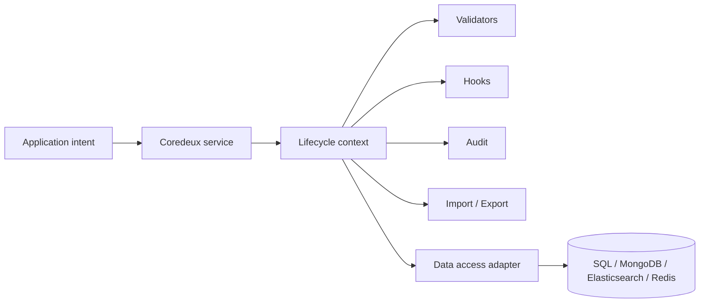
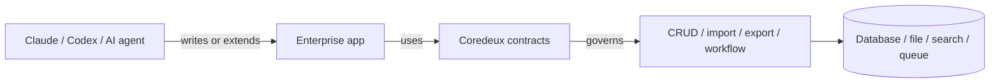
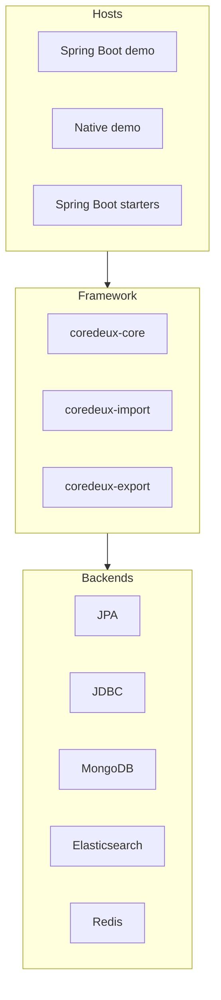

# Coredeux

<!-- docs-nav-start -->
[Documentation Home](README.md) | [Next: Getting Started In 10 Minutes](02-getting-started-in-10-minutes.md)
<!-- docs-nav-end -->

Coredeux standardizes the repetitive infrastructure of enterprise Java
applications and keeps it usable across both Spring Boot and native hosts.

It is a framework for the parts of an application that keep getting rebuilt:
validation, hooks, audit, import, export, workflow-style extensions, and
storage routing.

It is not just a CRUD library. It is meant to sit around the application so the
common framework behavior stays consistent instead of being scattered across
every service.

## The One-Line Identity

Coredeux is an enterprise application runtime for governed, contract-driven
behavior.

## The Simple Mental Model

Think of Coredeux like this:

```text
define the capability -> apply framework behavior -> run it through the right backend
```

That is the shape the framework is trying to keep stable.

An application says what it wants to do. Coredeux takes care of the repeatable
parts around that intent.



## Why It Exists

Enterprise systems keep rebuilding the same kinds of behavior:

- load and update records
- validate input
- apply hooks and side effects
- import and export data
- keep behavior consistent across different storage choices
- make the application easier to extend without rewriting the same patterns

Coredeux exists to make those pieces framework-owned instead of copied into
every new service.

That matters now because most Java enterprise apps still run in the Spring
Boot world, and in the future those apps will also need clean integration with
AI agents and MCP-style tools.

## Why Coredeux Is Relevant Now

Coredeux has a dual role:

- it provides the building blocks for enterprise applications
- it can embed into existing Java and Spring applications without forcing a
  rewrite

That means it can fit into the world we already have while preparing for the
world that is coming.

Future enterprise apps will not just be built by humans. They will also need to
work with agents, and those agents will need a framework they can understand
and use. Coredeux is trying to be that framework.



## What The Repository Shows Today

This repository contains the current building blocks for that direction:

- core framework contracts and lifecycle context
- entity definition loading and registry support
- validator, hook, and audit contracts
- JPA, JDBC, MongoDB, Elasticsearch, and Redis data-access implementations
- import and export support
- Spring Boot starter modules for Spring-based hosts
- a native Java demo host for plain Java usage
- a Spring Boot demo host for Spring-based usage

These pieces are useful on their own, but they are also part of a larger story:
Coredeux is shaping the common mechanics so enterprise apps stay predictable as
they grow.



## What Coredeux Is Not

Coredeux is not:

- a front-end application
- a database
- only Spring Boot
- only plain Java
- a single storage implementation
- a finished platform with no more evolution

The demos are examples of how to consume the framework. They are not the
framework itself.

## Why This Matters

Teams usually need more than a working endpoint. They need a consistent way to
keep business operations, backend selection, import/export flows, and future
integration paths aligned over time.

That is the value Coredeux is aiming for: keeping the common mechanics stable
enough that both humans and agents can work with them safely.

## 01. Start Here

- [Getting Started In 10 Minutes](02-getting-started-in-10-minutes.md)
- [Tour Of The Demo](03-tour-of-the-demo.md)

## 02. Product Direction

- [Overview](overview/README.md)
- [Vision](overview/vision.md)
- [Roadmap](overview/roadmap.md)

## 03. Coredeux Core

- [Coredeux Core](modules/coredeux-core/README.md)
- [Overview](modules/coredeux-core/01-overview.md)
- [Lifecycle Model](modules/coredeux-core/02-lifecycle.md)
- [Entity Definitions](modules/coredeux-core/03-entity-definitions.md)
- [External Entity Definition Sources](modules/coredeux-core/04-external-entity-definition-source.md)
- [Module System](modules/coredeux-core/05-modules.md)
- [Add Or Choose A Data Access Service](modules/coredeux-core/06-add-data-access-service.md)
- [Available Data Access Implementations](modules/coredeux-core/07-available-data-access-implementations.md)
- [Add a Hook](modules/coredeux-core/08-add-hook.md)
- [Add a Validator](modules/coredeux-core/09-add-validator.md)
- [Add Audit](modules/coredeux-core/10-add-audit.md)
- [Adding a New Entity](modules/coredeux-core/11-add-new-entity.md)
- [Adding a Core Module](modules/coredeux-core/12-add-core-module.md)
- [Reference](modules/coredeux-core/13-reference.md)
- [Core JPA Reference](modules/coredeux-core/14-core-jpa-reference.md)
- [Core JDBC Reference](modules/coredeux-core/15-core-jdbc-reference.md)
- [Core Elasticsearch Reference](modules/coredeux-core/16-core-elasticsearch-reference.md)
- [Core MongoDB Reference](modules/coredeux-core/17-core-mongodb-reference.md)
- [Core Redis Reference](modules/coredeux-core/18-core-redis-reference.md)

## 04. Import And Export

- [Coredeux Import](modules/coredeux-import/01-overview.md)
- [Coredeux Export](modules/coredeux-export/01-overview.md)

## 05. Native Demo Companion

- [Native Getting Started In 10 Minutes](miscellaneous/01-native-getting-started-in-10-minutes.md)
- [Native Tour Of The Demo](miscellaneous/02-native-tour-of-the-demo.md)

## 06. Spring Boot Import Integration

- [Import Into An Existing Spring Boot App](miscellaneous/03-import-into-an-existing-spring-boot-app.md)

## 07. Platform And Project

- [Platform Documentation](platform/README.md)
- [Project](project/README.md)
- [Governance Model](project/governance.md)
- [Release Process](project/release-process.md)
- [Security Policy](project/security.md)
- [Third-Party Notices](project/third-party-notices.md)

Use the core pages when you want the framework model, the module pages when
you want concrete behavior, and the project pages when you need governance or
release context.

<!-- docs-nav-start -->
[Documentation Home](README.md) | [Next: Getting Started In 10 Minutes](02-getting-started-in-10-minutes.md)
<!-- docs-nav-end -->
