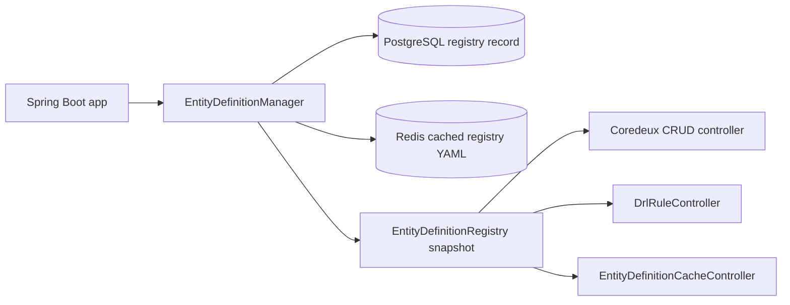

# Coredeux DRL Spring Boot Demo

<!-- docs-nav-start -->
[Previous: Import Into An Existing Spring Boot App](/03-import-into-an-existing-spring-boot-app) | [Documentation Home](/) | [Next: Platform Documentation](/platform)
<!-- docs-nav-end -->

This guide explains the `examples/coredeux-drl-spring-boot-demo` module as it
exists in the repository today.

It is a Spring Boot application that shows how Coredeux DRL works with:

- PostgreSQL for application data and stored DRL records
- Redis for the cached entity-definition registry
- Spring MVC controllers for the public HTTP surface
- Java-native handlers and DRL-backed handlers side by side
- Java-to-DRL conversion through `coredeux-drl-devtools`

The goal of this page is to describe the demo from the code that is actually
present, not from an imagined ideal version of it.

## What This Demo Is

The demo is a standalone Spring Boot application that lives under:

```text
examples/coredeux-drl-spring-boot-demo
```

Its `pom.xml` shows the key dependencies:

- `coredeux-core-spring-boot-starter`
- `coredeux-drl-spring-boot-starter`
- `coredeux-drl-devtools`
- `coredeux-core-jpa-spring-boot-starter`
- `spring-boot-starter-web`
- `spring-boot-starter-data-redis`
- PostgreSQL JDBC driver
- `springdoc-openapi-starter-webmvc-ui`

The project is built for Java 21.

## What The App Starts With

The application entrypoint is:

```text
examples/coredeux-drl-spring-boot-demo/src/main/java/com/coredeux/demo/CoredeuxDemoApplication.java
```

It is a Spring Boot application that scans `com.coredeux` and enables
scheduling.

At startup, the app also has a bootstrap runner:

```text
examples/coredeux-drl-spring-boot-demo/src/main/java/com/coredeux/demo/DemoEntityDefinitionBootstrapRunner.java
```

That runner loads entity definitions from the bootstrap YAML file when the
property `coredeux.demo.entity-definitions.bootstrap-enabled` is `true`.
In `application.yml`, that property is enabled by default.

The bootstrap file is:

```text
classpath:coredeux-entities.yml
```

## The Main Runtime Pieces

The demo splits its runtime into a few small parts:



The important classes are:

- `CoredeuxDemoApplication`
- `DemoEntityDefinitionBootstrapRunner`
- `EntityDefinitionManager`
- `DatabaseBackedEntityDefinitionRegistry`
- `DemoEntityResolver`
- `CoredeuxCrudController`
- `DrlRuleController`
- `EntityDefinitionCacheController`

## Configuration Files

The application configuration is split across two files:

```text
examples/coredeux-drl-spring-boot-demo/src/main/resources/application.yml
examples/coredeux-drl-spring-boot-demo/src/main/resources/coredeux-entities.yml
```

### `application.yml`

This file configures:

- PostgreSQL connection details
- Redis connection details
- Spring Data JPA settings
- the Coredeux entity-definition bootstrap location
- the Coredeux entity-definition registry code
- the Redis key used for the cached registry
- Swagger UI and OpenAPI paths

The defaults in the current code are:

- registry code: `coredeux-demo`
- bootstrap location: `classpath:coredeux-entities.yml`
- Redis key: `coredeux:demo:entity-definitions`
- bootstrap enabled: `true`

### `coredeux-entities.yml`

This file defines the entities that Coredeux should manage in the demo.
The current file includes two entries:

- `com.coredeux.demo.domain.Customer`
- `com.coredeux.demo.domain.DrlRuleRecord`

The `Customer` entry declares:

- storage through `customerDataAccess.drl`
- validator handlers:
  - `customerEmailValidator`
  - `customerValidator.drl`
- hook handlers:
  - `demoLifecycleHook`
  - `customerHook.drl`
- audit handlers:
  - `demoAuditHandler`
  - `customerAudit.drl`

The handler order in YAML is the order the runtime uses.

## The Data Model

The demo domain model lives under:

```text
examples/coredeux-drl-spring-boot-demo/src/main/java/com/coredeux/demo/domain
```

### `Customer`

`Customer` is the main business entity in the demo.

It extends `Item`, so it inherits:

- `pk`
- `creationTime`
- `modifiedTime`

The `Customer` entity adds:

- `name`
- `email`
- `active`
- `status`
- `lastLifecycleTouch`

The `CustomerStatus` enum contains:

- `NEW`
- `ACTIVE`
- `SUSPENDED`

### `DrlRuleRecord`

`DrlRuleRecord` is the entity the demo uses to store DRL source records.

It is mapped to the `drl_rules` table and contains:

- `code`
- `description`
- `drl`

The entity-definition YAML also registers `DrlRuleRecord`, so the demo can
handle it through the normal Coredeux data-access path.

### `EntityDefinitionRegistryRecord`

The entity-definition registry itself is stored in the database as
`EntityDefinitionRegistryRecord`.

It contains:

- `code`
- `sourceLocation`
- `yaml`
- `updatedAt`

## How The Entity Registry Works

The registry behavior is managed by:

```text
examples/coredeux-drl-spring-boot-demo/src/main/java/com/coredeux/demo/definition/EntityDefinitionManager.java
```

That manager does four important things:

1. loads the bootstrap YAML from classpath
2. stores the registry record in PostgreSQL
3. caches the registry YAML in Redis
4. keeps an in-memory snapshot of the parsed registry

The current lookup order is:

1. in-memory snapshot
2. Redis cache
3. database registry record
4. bootstrap file if nothing else is available

The registry implementation that other code uses is:

```text
DatabaseBackedEntityDefinitionRegistry
```

It is marked `@Primary`, so the demo uses the database-backed registry by
default.

## The CRUD Surface

The generic CRUD controller is:

```text
examples/coredeux-drl-spring-boot-demo/src/main/java/com/coredeux/demo/controllers/CoredeuxCrudController.java
```

It exposes:

- `POST /api/entities/{entityName}`
- `GET /api/entities/{entityName}/{id}`
- `GET /api/entities/{entityName}`
- `PUT /api/entities/{entityName}/{id}`
- `DELETE /api/entities/{entityName}/{id}`

Important detail: the controller resolves `entityName` as the full class name.
In other words, use values like:

```text
com.coredeux.demo.domain.Customer
```

not the short YAML alias `customer`.

### Create And Update Flow

`CoredeuxCrudController` uses `DemoEntityResolver` to:

- resolve the entity definition
- resolve the Java type
- resolve the identifier field type
- apply the identifier value back onto the object on update

The request body is a JSON object that gets converted into the entity type by
Jackson.

Example body for `Customer`:

```json
{
  "name": "Alice Example",
  "email": "alice@example.com",
  "active": true,
  "status": "ACTIVE"
}
```

## The DRL Rule Surface

The DRL rule controller is:

```text
examples/coredeux-drl-spring-boot-demo/src/main/java/com/coredeux/demo/controllers/DrlRuleController.java
```

It currently exposes these endpoints:

- `GET /api/drl/rules`
- `GET /api/drl/rules/{ruleId}`
- `POST /api/drl/rules/convert`
- `DELETE /api/drl/rules/{ruleId}`
- `DELETE /api/drl/rules/cache/{ruleId}`
- `DELETE /api/drl/rules/cache`

There is no general DRL execution endpoint in the current controller surface.
This demo focuses on storing rules, converting Java-like source into DRL, and
managing the compiled cache.

### Listing Stored Rules

`GET /api/drl/rules` returns the stored `DrlRuleRecord` rows.

### Reading A Stored Rule

`GET /api/drl/rules/{ruleId}` returns the stored DRL text for a rule code.

### Converting Java Source To DRL

`POST /api/drl/rules/convert` accepts raw source text in the request body.
The current controller method signature is `@RequestBody String source`, so the
body should be plain text, not a JSON wrapper.

The convert path uses `AnnotationBasedJavaToDrlConverter` from
`coredeux-drl-devtools`, then stores the generated DRL through
`DemoDrlRuleSourceService`.

That service also returns the stored record, and the controller immediately
calls `drlService.compileAndCache(record.getCode(), record.getDrl())` so the
compiled result is ready for runtime use.

Example of the kind of source the demo is converting:

```java
@DrlDefinition("customerValidator.drl")
public class CustomerDrlValidatorRuleSource {

    @DrlRule(name = "validate", when = "$context : RuleContext(method == 'validate')")
    public void validate(RuleContext<List<ValidationError>> $context) {
        ...
    }
}
```

### Deleting A Stored Rule

`DELETE /api/drl/rules/{ruleId}` removes the stored record and purges the
matching DRL cache entry.

### Purging The DRL Cache

- `DELETE /api/drl/rules/cache/{ruleId}` removes one cached compiled rule
- `DELETE /api/drl/rules/cache` clears the whole cached rule set

## The Entity-Definition Cache Surface

The entity-definition cache controller is:

```text
examples/coredeux-drl-spring-boot-demo/src/main/java/com/coredeux/demo/controllers/EntityDefinitionCacheController.java
```

It exposes:

- `GET /api/drl/entity-definitions/cache`
- `GET /api/drl/entity-definitions/cache/yml`
- `POST /api/drl/entity-definitions/cache/refresh`
- `POST /api/drl/entity-definitions/cache/bootstrap`
- `PUT /api/drl/entity-definitions/cache`
- `DELETE /api/drl/entity-definitions/cache`

### What The Status Endpoint Returns

`GET /api/drl/entity-definitions/cache` returns a small JSON object with:

- whether the registry YAML is cached in Redis
- whether a registry record exists
- the current registry code

### What The Refresh Endpoint Does

`POST /api/drl/entity-definitions/cache/refresh` reloads the current registry
YAML into the Redis cache and refreshes the in-memory snapshot.

### What The Bootstrap Endpoint Does

`POST /api/drl/entity-definitions/cache/bootstrap` reloads the registry from
the bootstrap YAML file.

### What The Update Endpoint Does

`PUT /api/drl/entity-definitions/cache` accepts raw YAML text in the request
body.

It also accepts an optional query parameter:

```text
sourceLocation
```

If you omit the parameter, the controller defaults it to `postman`.

### What The YML Endpoint Does

`GET /api/drl/entity-definitions/cache/yml` returns the cached registry YAML
string as plain text.

### What The Purge Endpoint Does

`DELETE /api/drl/entity-definitions/cache` removes the Redis cache entry and
clears the in-memory registry snapshot.

## The Java-Native And DRL-backed Examples

The demo intentionally keeps Java-native and DRL-backed implementations side by
side.

### Data access

The Java-like DRL source for data access is:

```text
examples/coredeux-drl-spring-boot-demo/src/main/java/com/coredeux/demo/drl/dataaccess/CustomerDrlDataAccessRuleSource.java
```

It declares `@DrlDefinition("customerDataAccess.drl")` and a global
`CoredeuxComponentRegistry`.

The DRL rules inside it cover:

- `load`
- `save`
- `update`
- `remove`
- `loadAll`
- `supportedComparators`
- `query`
- `refresh`

Each rule resolves the `postgresCoredeuxJpaDataAccessService` bean through the
registry and delegates to the Coredeux JPA data-access service.

The YAML uses `customerDataAccess.drl` as the storage data-access service for
`Customer`.

### Validators

The Java-native validator is:

```text
examples/coredeux-drl-spring-boot-demo/src/main/java/com/coredeux/demo/validation/CustomerEmailValidator.java
```

The DRL-backed validator source is:

```text
examples/coredeux-drl-spring-boot-demo/src/main/java/com/coredeux/demo/drl/validation/CustomerDrlValidatorRuleSource.java
```

The Java validator checks the `status` field and returns `ValidationError`
items.

The DRL validator checks the customer object, name, and email and writes the
errors to `RuleContext<List<ValidationError>>`.

### Hooks

The Java-native hook is:

```text
examples/coredeux-drl-spring-boot-demo/src/main/java/com/coredeux/demo/hooks/DemoLifecycleHook.java
```

The DRL-backed hook source is:

```text
examples/coredeux-drl-spring-boot-demo/src/main/java/com/coredeux/demo/drl/hooks/CustomerDrlHookRuleSource.java
```

The Java hook logs lifecycle events and updates the customer touch timestamp.

The DRL hook source also updates `lastLifecycleTouch` and logs to the console.

### Audit

The Java-native audit handler is:

```text
examples/coredeux-drl-spring-boot-demo/src/main/java/com/coredeux/demo/audit/DemoAuditHandler.java
```

The DRL-backed audit source is:

```text
examples/coredeux-drl-spring-boot-demo/src/main/java/com/coredeux/demo/drl/audit/CustomerDrlAuditRuleSource.java
```

The Java audit handler records audit entries in an in-memory list and logs to
the console.

The DRL audit source logs the phase and sets a message on the rule context.

## The Rule Authoring Shape

The DRL demo follows the same authoring pattern used by the converter:

1. write Java-like rule source with `@DrlDefinition`, `@DrlGlobal`, and
   `@DrlRule`
2. convert the source through the DRL DevTools converter
3. store the generated DRL in the database
4. compile and cache the generated DRL
5. resolve and execute it later through `DRLService`

The important constraint from the current code is that helper methods in the
Java authoring class are not preserved as reusable DRL methods after
conversion. The converted rule method must remain self-contained.

That is why the demo keeps reusable behavior in separate application services
or separate DRL sources instead of assuming Java method reuse will survive the
conversion step.

## Error Handling

The demo has two exception handler classes:

- `CoredeuxDemoExceptionHandler`
- `DrlDemoExceptionHandler`

The responses are simple JSON maps.

Validation errors return:

- `message`
- `validationErrors`

DRL conversion errors return:

- `message`

Missing DRL rules return:

- `message`

## What To Try First

If you want to explore the demo in the least surprising order, start here:

1. open Swagger UI at `/swagger-ui.html`
2. call the generic CRUD route with the full class name of `Customer`
3. inspect `GET /api/drl/entity-definitions/cache`
4. inspect `GET /api/drl/rules`
5. convert a plain Java-like source string with `POST /api/drl/rules/convert`
6. reload or purge the registry cache if you change the registry YAML

## Test Flow Walkthrough

The Postman collection now includes a dedicated `Test Flow` folder.
That folder is the best way to understand how the demo behaves end to end.

Before you run it, read these files side by side:

- [application.yml](C:/Data/Development/Coredeux/oss/coredeux/examples/coredeux-drl-spring-boot-demo/src/main/resources/application.yml)
- [coredeux-entities.yml](C:/Data/Development/Coredeux/oss/coredeux/examples/coredeux-drl-spring-boot-demo/src/main/resources/coredeux-entities.yml)
- [DrlRuleController.java](C:/Data/Development/Coredeux/oss/coredeux/examples/coredeux-drl-spring-boot-demo/src/main/java/com/coredeux/demo/controllers/DrlRuleController.java)
- [EntityDefinitionCacheController.java](C:/Data/Development/Coredeux/oss/coredeux/examples/coredeux-drl-spring-boot-demo/src/main/java/com/coredeux/demo/controllers/EntityDefinitionCacheController.java)
- [CoredeuxCrudController.java](C:/Data/Development/Coredeux/oss/coredeux/examples/coredeux-drl-spring-boot-demo/src/main/java/com/coredeux/demo/controllers/CoredeuxCrudController.java)
- [DemoDrlRuleSourceService.java](C:/Data/Development/Coredeux/oss/coredeux/examples/coredeux-drl-spring-boot-demo/src/main/java/com/coredeux/demo/drl/DemoDrlRuleSourceService.java)
- [CustomerDrlValidatorRuleSource.java](C:/Data/Development/Coredeux/oss/coredeux/examples/coredeux-drl-spring-boot-demo/src/main/java/com/coredeux/demo/drl/validation/CustomerDrlValidatorRuleSource.java)
- [CustomerDrlHookRuleSource.java](C:/Data/Development/Coredeux/oss/coredeux/examples/coredeux-drl-spring-boot-demo/src/main/java/com/coredeux/demo/drl/hooks/CustomerDrlHookRuleSource.java)
- [CustomerDrlAuditRuleSource.java](C:/Data/Development/Coredeux/oss/coredeux/examples/coredeux-drl-spring-boot-demo/src/main/java/com/coredeux/demo/drl/audit/CustomerDrlAuditRuleSource.java)
- [CustomerEmailValidator.java](C:/Data/Development/Coredeux/oss/coredeux/examples/coredeux-drl-spring-boot-demo/src/main/java/com/coredeux/demo/validation/CustomerEmailValidator.java)
- [DemoLifecycleHook.java](C:/Data/Development/Coredeux/oss/coredeux/examples/coredeux-drl-spring-boot-demo/src/main/java/com/coredeux/demo/hooks/DemoLifecycleHook.java)
- [DemoAuditHandler.java](C:/Data/Development/Coredeux/oss/coredeux/examples/coredeux-drl-spring-boot-demo/src/main/java/com/coredeux/demo/audit/DemoAuditHandler.java)

The flow is intentionally staged so you can see the database, the DRL compiler,
the runtime cache, and the lifecycle handlers all react in sequence.

### Step 1 To Step 4: Create A DRL Entry In The Database

The first four requests in the `Test Flow` folder create a DRL record in the
database.

What happens in this stage:

1. the request sends Java-like source text to `POST /api/drl/rules/convert`
2. `DrlRuleController.convert(...)` forwards the raw source to `DemoDrlRuleSourceService`
3. `DemoDrlRuleSourceService` runs the source through `AnnotationBasedJavaToDrlConverter`
4. the generated DRL is stored as a `DrlRuleRecord`

The key thing to notice is that the demo is not executing the source yet.
It is only creating and persisting the rule entry.

At this point, the database row exists, and the rule code is now a stored
artifact that can be compiled and cached later.

### Step 5 To Step 8: Convert, Update, Compile, And Cache

The next four requests update the Java source and send it through the same
conversion path again.

What happens in this stage:

1. the Java source is edited in the Postman request body
2. the updated source is posted again to `POST /api/drl/rules/convert`
3. the generated DRL replaces the stored text in the database
4. `DrlRuleController` immediately calls `drlService.compileAndCache(...)`
5. the compiled `KieBase` is stored in the DRL cache

This is the runtime bridge that the demo is trying to show:

- source changes are captured in the database
- compilation happens after the save
- the runtime cache is refreshed with the new compiled rule

The important files to check while you watch this happen are:

- [DemoDrlRuleSourceService.java](C:/Data/Development/Coredeux/oss/coredeux/examples/coredeux-drl-spring-boot-demo/src/main/java/com/coredeux/demo/drl/DemoDrlRuleSourceService.java)
- [DrlRuleController.java](C:/Data/Development/Coredeux/oss/coredeux/examples/coredeux-drl-spring-boot-demo/src/main/java/com/coredeux/demo/controllers/DrlRuleController.java)
- [DRLService.java](C:/Data/Development/Coredeux/oss/coredeux/modules/coredeux-drl/src/main/java/com/coredeux/drl/service/DRLService.java)
- [DefaultDRLService.java](C:/Data/Development/Coredeux/oss/coredeux/modules/coredeux-drl/src/main/java/com/coredeux/drl/service/impl/DefaultDRLService.java)

### Step 9: Validation Fails With The Initial Message

Step 9 tries to create a `Customer` with:

- a missing `status`
- an invalid `email` pattern

The response at this point is expected to contain:

```json
{
  "validationErrors": [
    {
      "field": "status",
      "message": "Customer status is required"
    },
    {
      "field": "email",
      "message": "Customer email must be a valid email"
    }
  ],
  "message": "Validation failed for class: com.coredeux.demo.domain.Customer"
}
```

What is happening here:

1. `CoredeuxCrudController` handles the create request
2. the runtime resolves the entity definition for `Customer`
3. the YAML declares both a Java validator and a DRL validator for the same module
4. validation runs against the current configuration
5. the result is returned as `validationErrors`

This step is useful because it proves that the validator is not just a static
class. It is part of the runtime contract that guards the create operation.

### Step 10: Change The DRL Validator Source

Step 10 edits the Java source of
[CustomerDrlValidatorRuleSource.java](C:/Data/Development/Coredeux/oss/coredeux/examples/coredeux-drl-spring-boot-demo/src/main/java/com/coredeux/demo/drl/validation/CustomerDrlValidatorRuleSource.java).

The message for the email error is changed from:

```text
Customer email must be a valid email
```

to:

```text
Customer email must be a valid email. It needs @.
```

Then the updated Java source is converted again through the same
`POST /api/drl/rules/convert` endpoint.

What happens in this stage:

1. the stored DRL record in the database is updated
2. the new DRL is compiled
3. the compiled rule is stored in the DRL cache

This is the clearest place in the demo where the dynamic runtime logic shows
up as a real behavior, not just a design idea.

### Step 11: Validation Uses The New Message

Step 11 repeats the invalid customer create request.

The response now returns the updated email message:

```json
{
  "validationErrors": [
    {
      "field": "status",
      "message": "Customer status is required"
    },
    {
      "field": "email",
      "message": "Customer email must be a valid email. It needs @."
    }
  ],
  "message": "Validation failed for class: com.coredeux.demo.domain.Customer"
}
```

This is the core runtime lesson of the demo: the behavior changed without
rebuilding the application.

### Step 12: Successful Create And Lifecycle Output

Step 12 creates the `Customer` with valid details.

This time the create request succeeds, and the console shows the lifecycle
messages from both Java-native and DRL-backed handlers:

```text
Before Save hook invoked for customer: Alice Example
After Save hook invoked for customer: Alice Example
Auditing entity: com.coredeux.demo.domain.Customer@7cd3e3b8 with definition: customer in context: EntityLifecycleContext(operation=UPSERT, identifier=1, oldValue=null, newValue=com.coredeux.demo.domain.Customer@7cd3e3b8)
Auditing customer with DRL: UPSERT
On Load hook invoked for customer: Alice Example
```

What that console output tells you:

1. the Java hook ran
2. the Java audit handler ran
3. the DRL audit source ran
4. the entity was created successfully
5. the loaded entity came back through the normal CRUD path

This step ties the whole demo together. The same entity definition can use a
mix of Java-native and DRL-backed behavior, and the runtime still routes the
operation through the same controller and entity definition model.

## What To Watch While You Run The Flow

When you run the `Test Flow`, keep these three things open:

1. the Postman collection
2. the source files listed at the top of this page
3. `application.yml` and `coredeux-entities.yml`

That combination makes the control flow much easier to follow:

- the Postman requests show the runtime behavior
- the source files show the authored Java and DRL-backed logic
- the configuration files show which handlers and storage services are active

## Why The Flow Matters

This demo is not just about CRUD.

It is showing a repeatable Coredeux pattern:

- store the rule source
- convert it
- persist the generated DRL
- compile it
- cache it
- run the host application against that runtime behavior

That is the part worth understanding if you are reading the demo as a
developer or as an agent.

## Postman

The repository includes a Postman collection for this demo here:

```text
examples/coredeux-drl-spring-boot-demo/postman/coredeux-demo.postman_collection.json
```

It mirrors the current controller surface.

## What This Demo Does Not Claim To Be

This module is a demo, not a finished product line.

It is not trying to be:

- a generic business app template
- a hidden runtime execution service with no source code
- a replacement for the core DRL module docs
- a substitute for the converter documentation in `coredeux-drl-devtools`

It is a concrete sample showing how the Spring Boot host, the DRL starter, the
devtools converter, PostgreSQL, and Redis are wired together in the repository
today.

## If You Want To Read The Code Next

The most useful files to inspect after this guide are:

```text
examples/coredeux-drl-spring-boot-demo/src/main/java/com/coredeux/demo/CoredeuxDemoApplication.java
examples/coredeux-drl-spring-boot-demo/src/main/java/com/coredeux/demo/DemoEntityDefinitionBootstrapRunner.java
examples/coredeux-drl-spring-boot-demo/src/main/java/com/coredeux/demo/definition/EntityDefinitionManager.java
examples/coredeux-drl-spring-boot-demo/src/main/java/com/coredeux/demo/controllers/CoredeuxCrudController.java
examples/coredeux-drl-spring-boot-demo/src/main/java/com/coredeux/demo/controllers/DrlRuleController.java
examples/coredeux-drl-spring-boot-demo/src/main/java/com/coredeux/demo/controllers/EntityDefinitionCacheController.java
examples/coredeux-drl-spring-boot-demo/src/main/java/com/coredeux/demo/drl/DemoDrlRuleSourceService.java
examples/coredeux-drl-spring-boot-demo/src/main/resources/coredeux-entities.yml
examples/coredeux-drl-spring-boot-demo/src/main/resources/application.yml
```

<!-- docs-nav-start -->
[Previous: Import Into An Existing Spring Boot App](/03-import-into-an-existing-spring-boot-app) | [Documentation Home](/) | [Next: Platform Documentation](/platform)
<!-- docs-nav-end -->
