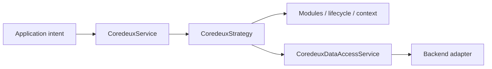
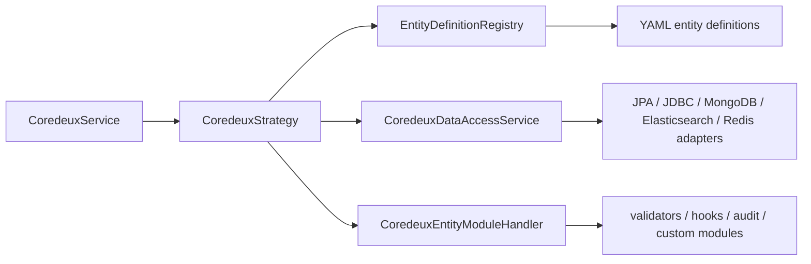

# coredeux-core Reference

<!-- docs-nav-start -->
[Previous: Adding a Core Module](12-add-core-module.md) | [Documentation Home](../../README.md) | [Next: Core JPA Reference](14-core-jpa-reference.md)
<!-- docs-nav-end -->

This is the technical reference for the Coredeux core layer and its storage
adapters.

It is written for agents and developers who need to understand the framework
without reading the source tree line by line. The goal is not to restate the
tutorial pages. The goal is to explain the moving parts, the contracts between
them, and the places where you extend or replace behavior.

Use this document together with:

- [Overview](01-overview.md)
- [Lifecycle Model](02-lifecycle.md)
- [Entity Definitions](03-entity-definitions.md)
- [Property Resolution Order](19-property-resolution-order.md)
- [Module System](05-modules.md)
- [Add Or Choose A Data Access Service](06-add-data-access-service.md)
- [Available Data Access Implementations](07-available-data-access-implementations.md)
- [Add a Hook](08-add-hook.md)
- [Add a Validator](09-add-validator.md)
- [Add Audit](10-add-audit.md)
- [Adding a New Entity](11-add-new-entity.md)
- [Adding a Core Module](12-add-core-module.md)

## What This Layer Is

`coredeux-core` is the framework kernel and the contract boundary for the
rest of the platform.

It owns:

- entity-definition loading
- lifecycle orchestration
- module dispatch
- validation and audit wiring
- request and operation context
- reflection helpers
- structured-search contracts
- the public `CoredeuxService` API
- the internal `CoredeuxStrategy` and `CoredeuxModuleService` APIs

It does not own:

- HTTP transport
- controller routing
- persistence technology details
- import/export orchestration
- Spring Boot web concerns

Those live in adapter modules, Spring starters, or host applications.

If you are trying to understand where a property value comes from in a Spring
Boot host, read [Property Resolution Order](19-property-resolution-order.md).
That page explains the override order without mixing it into the rest of the
core runtime reference.

If you remember one thing, remember this:



The framework stays legible because the contracts stay stable.

## Architectural Shape

The core runtime is easier to understand as a pipeline:



The important rule is simple:

- `CoredeuxService` is the public entry point
- `CoredeuxStrategy` coordinates the lifecycle
- `CoredeuxDataAccessService` owns persistence
- `CoredeuxEntityModuleHandler` owns module-specific behavior

Everything else hangs off those four ideas.

## Package Map

Main packages in `coredeux-core`:

- `com.coredeux.core.audit`
- `com.coredeux.core.config`
- `com.coredeux.core.context`
- `com.coredeux.core.definition`
- `com.coredeux.core.exceptions`
- `com.coredeux.core.helper`
- `com.coredeux.core.hooks`
- `com.coredeux.core.loader`
- `com.coredeux.core.module`
- `com.coredeux.core.registry`
- `com.coredeux.core.resolver`
- `com.coredeux.core.search`
- `com.coredeux.core.service`
- `com.coredeux.core.strategy`
- `com.coredeux.core.validation`

Storage adapters live in sibling modules:

- `modules/coredeux-core-jpa`
- `modules/coredeux-core-jdbc`
- `modules/coredeux-core-mongodb`
- `modules/coredeux-core-elasticsearch`
- `modules/coredeux-core-redis`

Spring Boot wrappers for those adapters live in:

- `modules/spring-boot-starters/coredeux-core-jpa-spring-boot-starter`
- `modules/spring-boot-starters/coredeux-core-jdbc-spring-boot-starter`
- `modules/spring-boot-starters/coredeux-core-mongodb-spring-boot-starter`
- `modules/spring-boot-starters/coredeux-core-elasticsearch-spring-boot-starter`
- `modules/spring-boot-starters/coredeux-core-redis-spring-boot-starter`

## The Public Service Contract

File:

- [CoredeuxService.java](../../../modules/coredeux-core/src/main/java/com/coredeux/core/service/CoredeuxService.java)

This is the application-facing API.

Methods:

- `load(String id, Class<T> type)`
- `query(String query, Map<String, Object> params, Class<T> type, int pageSize, int currentPage)`
- `loadAll(List<SearchParams> params, Class<T> type, int pageSize, int currentPage)`
- `supportedComparators(Class<?> type)`
- `save(T entity)`
- `update(T entity)`
- `remove(String id, Class<T> type)`
- `remove(T entity)`
- `refresh(T entity)`

Behavior:

- no caller supplies `OperationContext`
- the service is storage-agnostic
- lifecycle context is created internally
- module execution is hidden behind the API

Default implementation:

- [DefaultCoredeuxService.java](../../../modules/coredeux-core/src/main/java/com/coredeux/core/service/impl/DefaultCoredeuxService.java)

The default implementation is intentionally thin. It forwards every call to the
strategy layer.

## The Strategy Layer

Files:

- [CoredeuxStrategy.java](../../../modules/coredeux-core/src/main/java/com/coredeux/core/strategy/CoredeuxStrategy.java)
- [DefaultCoredeuxStrategy.java](../../../modules/coredeux-core/src/main/java/com/coredeux/core/strategy/impl/DefaultCoredeuxStrategy.java)
- [AbstractCoredeuxStrategy.java](../../../modules/coredeux-core/src/main/java/com/coredeux/core/strategy/impl/AbstractCoredeuxStrategy.java)

`AbstractCoredeuxStrategy` is the orchestration base class. It is responsible
for:

- resolving the entity definition
- resolving the matching data access bean
- extracting and validating identifiers
- loading existing persisted state when needed
- building `OperationContext`
- dispatching enabled modules

Important helper methods:

- `getDefinition(Class<T> entityType)`
- `getDefinition(T entity)`
- `getDataAccessService(Class<T> entityType)`
- `executeModules(...)`
- `executeModule(...)`
- `createOperationContext(...)`
- `extractIdentifier(...)`
- `requireIdentifier(...)`
- `loadExistingEntity(...)`
- `requireExistingEntity(...)`

`DefaultCoredeuxStrategy` applies the operation semantics:

- `load(...)` -> data access load, then module execution for `load`
- `query(...)` -> structured query, then per-row load-phase modules
- `loadAll(...)` -> same pattern as `query(...)`
- `supportedComparators(...)` -> returns the adapter comparator set
- `save(...)` -> `CREATE` before persistence, `UPSERT` after persistence
- `update(...)` -> `MODIFY`
- `remove(...)` -> `DELETE`
- `refresh(...)` -> refresh phases

## The Module Service

File:

- [CoredeuxModuleService.java](../../../modules/coredeux-core/src/main/java/com/coredeux/core/service/CoredeuxModuleService.java)

Methods:

- `executeAll(T entity, String phase, String operation)`
- `executeModule(T entity, String moduleName, String phase, String operation)`

Default implementation:

- [DefaultCoredeuxModuleService.java](../../../modules/coredeux-core/src/main/java/com/coredeux/core/service/impl/DefaultCoredeuxModuleService.java)

Behavior:

- validates the request
- derives `OperationContext`
- resolves old state when the requested lifecycle operation needs it
- runs all enabled modules or one named module
- uses the current entity state as the execution entity for delete operations

This service exists for places where you want module execution without going
through the full CRUD API.

## Lifecycle And Phase Model

Lifecycle constants:

- [CoredeuxLifecycleOperations.java](../../../modules/coredeux-core/src/main/java/com/coredeux/core/strategy/CoredeuxLifecycleOperations.java)

Canonical operations:

- `CREATE`
- `MODIFY`
- `UPSERT`
- `DELETE`
- `FETCH`

Hook phase constants:

- [CoredeuxHookPhases.java](../../../modules/coredeux-core/src/main/java/com/coredeux/core/strategy/CoredeuxHookPhases.java)

Canonical phases:

- `load`
- `before-save`
- `after-save`
- `before-update`
- `after-update`
- `before-delete`
- `before-refresh`
- `after-refresh`

Important distinction:

- operation is the business meaning of the action
- phase is the point in the strategy where the action is happening

Example:

- `save(entity)` runs `CREATE` before persistence and `UPSERT` after persistence
- hooks can choose `before-save`, `after-save`, `before-update`, etc.
- audit maps phases to business operations

## Entity Definition Model

Files:

- [CoredeuxYamlConfiguration.java](../../../modules/coredeux-core/src/main/java/com/coredeux/core/definition/CoredeuxYamlConfiguration.java)
- [CoredeuxEntityDefinition.java](../../../modules/coredeux-core/src/main/java/com/coredeux/core/definition/CoredeuxEntityDefinition.java)
- [CoredeuxStorageDefinition.java](../../../modules/coredeux-core/src/main/java/com/coredeux/core/definition/CoredeuxStorageDefinition.java)
- [CoredeuxModuleDefinition.java](../../../modules/coredeux-core/src/main/java/com/coredeux/core/definition/CoredeuxModuleDefinition.java)
- [CoredeuxAttributeDefinition.java](../../../modules/coredeux-core/src/main/java/com/coredeux/core/definition/CoredeuxAttributeDefinition.java)

Root YAML shape:

```yaml
coredeux:
  entities:
    - full-class-name: com.example.customer.Customer
      name: customer
      identifier: pk
      storage:
        data-access-service: postgresCoredeuxJpaDataAccessService
      modules:
        - name: validators
          enabled: true
          handlers:
            - customerEmailValidator
        - name: hooks
          enabled: true
          handlers:
            - customerLifecycleHook
        - name: audit
          enabled: true
          handlers:
            - customerAuditHandler
          config:
            operations:
              - SAVE
              - UPDATE
              - DELETE
```

### `CoredeuxEntityDefinition`

Fields:

- `fullClassName`
- `name`
- `identifier`
- `storage`
- `modules`

Convenience methods:

- `getAudit()`
- `getValidators()`
- `getHooks()`
- `getAttributes()`
- `getModule(String moduleName)`
- `getModuleDefinition(String moduleName)`

Implementation detail:

- the registry uses `fullClassName` as the key
- `name` is a display and YAML name, not the registry identity

### `CoredeuxStorageDefinition`

Fields:

- `store`
- `dataAccessService`

The `dataAccessService` value is the bean name the strategy resolves.

### `CoredeuxModuleDefinition`

Fields:

- `name`
- `enabled`
- `handlers`
- `config`

Helper:

- `getConfigMap()`

The `config` object is intentionally untyped at the core boundary so custom
modules can carry arbitrary structure.

### `CoredeuxAttributeDefinition`

This is the typed model for the optional `attributes` module.

Fields:

- `name`
- `type`
- `required`
- `searchable`
- `validators`

## YAML Loading

Files:

- [EntityDefinitionLoader.java](../../../modules/coredeux-core/src/main/java/com/coredeux/core/loader/EntityDefinitionLoader.java)
- [YamlEntityDefinitionLoader.java](../../../modules/coredeux-core/src/main/java/com/coredeux/core/loader/YamlEntityDefinitionLoader.java)

`YamlEntityDefinitionLoader`:

- reads YAML from `InputStream` or `Path`
- expects root key `coredeux`
- expects `entities` to be a list
- defaults `name` to `fullClassName` when omitted
- converts unknown module config recursively into immutable `Map` and `List`
- treats `attributes` as a typed special case

Validation rules enforced today:

- YAML document must not be empty
- `full-class-name` is required
- `identifier` is required
- `storage` is required
- `storage.data-access-service` is required
- module `name` is required

Registry files:

- [EntityDefinitionRegistry.java](../../../modules/coredeux-core/src/main/java/com/coredeux/core/registry/EntityDefinitionRegistry.java)
- [InMemoryEntityDefinitionRegistry.java](../../../modules/coredeux-core/src/main/java/com/coredeux/core/registry/InMemoryEntityDefinitionRegistry.java)
- [EntityDefinitionRegistries.java](../../../modules/coredeux-core/src/main/java/com/coredeux/core/registry/EntityDefinitionRegistries.java)

Registry behavior:

- lookups are by `fullClassName`
- duplicate entity definitions are rejected
- the registry is immutable after construction in the common in-memory path

Spring bean:

- [CoredeuxEntityDefinitionConfiguration.java](../../../modules/coredeux-core/src/main/java/com/coredeux/core/config/CoredeuxEntityDefinitionConfiguration.java)

Config key:

- `coredeux.entities.config-location`

Default:

- `classpath:coredeux-entities.yml`

## Data Access Resolution

Files:

- [EntityDataAccessResolver.java](../../../modules/coredeux-core/src/main/java/com/coredeux/core/resolver/EntityDataAccessResolver.java)
- [EntityDefinitionBackedDataAccessResolver.java](../../../modules/coredeux-core/src/main/java/com/coredeux/core/resolver/EntityDefinitionBackedDataAccessResolver.java)

The resolver reads:

- `definition.storage.dataAccessService`

and returns the bean name the strategy should use.

If the bean name is missing, the core raises `CoredeuxValidationException`.

This means the strategy does not guess which adapter to use. The YAML makes
that decision explicit.

## Runtime Context Model

### `RequestContext`

File:

- [RequestContext.java](../../../modules/coredeux-core/src/main/java/com/coredeux/core/context/RequestContext.java)

Fields:

- `requestId`
- `correlationId`
- `userId`
- `tenantId`
- `locale`

Resolver:

- [DefaultCoredeuxRequestContextResolver.java](../../../modules/coredeux-core/src/main/java/com/coredeux/core/resolver/context/DefaultCoredeuxRequestContextResolver.java)

Resolution order:

1. request header
2. request parameter
3. request attribute

Supported keys:

- request id: `X-Request-Id`, `requestId`
- correlation id: `X-Correlation-Id`, `correlationId`
- user id: `X-User-Id`, `userId`
- tenant id: `X-Tenant-Id`, `tenantId`, `X-Site-Id`, `siteId`

If no servlet request exists, the resolver returns `null`.

### `EntityLifecycleContext<T>`

File:

- [EntityLifecycleContext.java](../../../modules/coredeux-core/src/main/java/com/coredeux/core/context/EntityLifecycleContext.java)

Fields:

- `operation`
- `identifier`
- `oldValue`
- `newValue`

This is the framework description of a single entity state transition.

### `OperationContext`

File:

- [OperationContext.java](../../../modules/coredeux-core/src/main/java/com/coredeux/core/context/OperationContext.java)

Fields:

- `invokedAt`
- `requestContext`
- `lifecycleContext`

Factory methods:

- `empty()`
- `withLifecycleContext(...)`

Strategy code creates this object. Callers normally do not.

## Module System

Base contract:

- [CoredeuxEntityModuleHandler.java](../../../modules/coredeux-core/src/main/java/com/coredeux/core/module/CoredeuxEntityModuleHandler.java)

Methods:

- `getModuleName()`
- `execute(...)`

Behavior:

- one handler bean per module name
- duplicate module names are rejected at startup
- missing module handlers are ignored, not fatal
- disabled modules are skipped

### Validators

Files:

- [CoredeuxEntityValidator.java](../../../modules/coredeux-core/src/main/java/com/coredeux/core/validation/CoredeuxEntityValidator.java)
- [ValidatorsModuleHandler.java](../../../modules/coredeux-core/src/main/java/com/coredeux/core/module/impl/ValidatorsModuleHandler.java)
- [ValidationError.java](../../../modules/coredeux-core/src/main/java/com/coredeux/core/validation/ValidationError.java)

Contract:

- `List<ValidationError> validate(T entity, CoredeuxEntityDefinition definition, OperationContext context)`

Execution:

- only runs on `before-save` and `before-update`
- all errors are aggregated
- any error raises `CoredeuxValidationException`
- blank handler names are ignored
- generic type compatibility is validated with `ResolvableType`

Demo example:

- bean name: `customerEmailValidator`
- entity: `Customer`
- checks: `name`, `email`, `status`

### Hooks

Files:

- [CoredeuxEntityHook.java](../../../modules/coredeux-core/src/main/java/com/coredeux/core/hooks/CoredeuxEntityHook.java)
- [HooksModuleHandler.java](../../../modules/coredeux-core/src/main/java/com/coredeux/core/module/impl/HooksModuleHandler.java)

Hook methods:

- `onLoad`
- `beforeSave`
- `afterSave`
- `beforeUpdate`
- `afterUpdate`
- `beforeDelete`
- `beforeRefresh`
- `afterRefresh`

Execution rules:

- one hook bean can implement the phases it needs
- blank handler names are ignored
- unsupported phase names fail with `CoredeuxStrategyException`
- runtime generic compatibility is validated

Demo examples:

- `demoLifecycleHook`
- `exportStorageCleanupHook`

### Audit

Files:

- [CoredeuxEntityAuditHandler.java](../../../modules/coredeux-core/src/main/java/com/coredeux/core/audit/CoredeuxEntityAuditHandler.java)
- [AuditModuleHandler.java](../../../modules/coredeux-core/src/main/java/com/coredeux/core/module/impl/AuditModuleHandler.java)

Contract:

- `void audit(T entity, CoredeuxEntityDefinition definition, OperationContext context)`

Current config shape:

```yaml
- name: audit
  enabled: true
  handlers:
    - demoAuditHandler
  config:
    operations:
      - SAVE
      - UPDATE
      - DELETE
```

Supported configured operations:

- `SAVE`
- `UPDATE`
- `DELETE`
- `ALL`

Current phase-to-operation mapping:

- `after-save` -> `SAVE`
- `after-update` -> `UPDATE`
- `before-delete` -> `DELETE`

Validation:

- `config.operations` is required
- operations must be supported values
- generic type compatibility is validated

Demo example:

- bean name: `demoAuditHandler`
- entities: `Customer`, `Product`, `CustomerOrder`, `Role`, `OrderItem`, `ExportStorageRecord`

### Custom Modules

Custom modules implement:

- [CoredeuxEntityModuleHandler.java](../../../modules/coredeux-core/src/main/java/com/coredeux/core/module/CoredeuxEntityModuleHandler.java)

The demo workflow module is the best example of a custom module with its own
phase policy.

The full pattern is:

1. entity YAML enables the module
2. module handler reads `config.phases`
3. module handler resolves configured handler beans by name
4. module handler decides whether the current phase should run
5. the configured bean performs the business action

That pattern is what you should copy when adding a new entity-level feature.

## Data Access Implementations

### SQL

Native modules:

- `coredeux-core-jpa`
- `coredeux-core-jdbc`

Bean names:

- `defaultCoredeuxJpaDataAccessService`
- `postgresCoredeuxJpaDataAccessService`
- `defaultCoredeuxJdbcDataAccessService`

Typical use:

- generic JPA persistence
- PostgreSQL-specific JPA with JSONB-aware behavior
- direct SQL/JDBC without JPA

Spring Boot starters:

- `coredeux-core-jpa-spring-boot-starter`
- `coredeux-core-jdbc-spring-boot-starter`

### NoSQL

Native modules:

- `coredeux-core-mongodb`
- `coredeux-core-elasticsearch`
- `coredeux-core-redis`

Bean names:

- `defaultCoredeuxMongoDataAccessService`
- `defaultCoredeuxElasticsearchDataAccessService`
- `defaultCoredeuxRedisDataAccessService`

Typical use:

- document persistence
- search-oriented document persistence
- Redis-backed JSON storage

Spring Boot starters:

- `coredeux-core-mongodb-spring-boot-starter`
- `coredeux-core-elasticsearch-spring-boot-starter`
- `coredeux-core-redis-spring-boot-starter`

### Spring Boot Versus Native

Spring Boot:

- beans are created by component scanning or starter auto-configuration
- you usually only write `@Bean` methods for overrides or custom adapters
- the application YAML points at the bean name

Native Java:

- you create the adapter manually
- you register it in your bootstrap registry
- the YAML still points at the same bean name

The bean name, not the package or module, is the actual link between entity
definition and storage adapter.

## Reflection Helper

Files:

- [CoredeuxReflectionHelperService.java](../../../modules/coredeux-core/src/main/java/com/coredeux/core/helper/CoredeuxReflectionHelperService.java)
- [DefaultCoredeuxReflectionHelperService.java](../../../modules/coredeux-core/src/main/java/com/coredeux/core/helper/impl/DefaultCoredeuxReflectionHelperService.java)

Use cases:

- identifier extraction
- field traversal through inheritance
- field read/write
- generic field discovery

Keep reflection logic here instead of scattering it through strategy code.

## Search Model

Files:

- [SearchParams.java](../../../modules/coredeux-core/src/main/java/com/coredeux/core/search/SearchParams.java)
- [SearchResult.java](../../../modules/coredeux-core/src/main/java/com/coredeux/core/search/SearchResult.java)
- [PaginationData.java](../../../modules/coredeux-core/src/main/java/com/coredeux/core/search/PaginationData.java)

### `SearchParams`

Fields:

- `field`
- `comparator`
- `value`

Representative JSON:

```json
{
  "field": "status",
  "comparator": "EQUALS",
  "value": "ACTIVE"
}
```

### `SearchResult<T>`

Fields:

- `results`
- `pagination`

### `PaginationData`

Fields:

- `currentPage`
- `totalResults`
- `pageSize`
- `totalPages`
- `resultSize`

Comparator support is adapter-defined and exposed through
`supportedComparators(Class<?> type)`.

## Exception Hierarchy

Files:

- [CoredeuxCoreException.java](../../../modules/coredeux-core/src/main/java/com/coredeux/core/exceptions/CoredeuxCoreException.java)
- [CoredeuxDataAccessException.java](../../../modules/coredeux-core/src/main/java/com/coredeux/core/exceptions/CoredeuxDataAccessException.java)
- [CoredeuxStrategyException.java](../../../modules/coredeux-core/src/main/java/com/coredeux/core/exceptions/CoredeuxStrategyException.java)
- [CoredeuxValidationException.java](../../../modules/coredeux-core/src/main/java/com/coredeux/core/exceptions/CoredeuxValidationException.java)

Usage:

- `CoredeuxValidationException` -> invalid caller input or invalid config
- `CoredeuxStrategyException` -> orchestration or dispatch failure
- `CoredeuxDataAccessException` -> adapter or storage failure

## Spring Integration Surface

When `coredeux-core` is on the classpath in a Spring Boot application, the
typical framework beans are:

- `entityDefinitionRegistry`
- `DefaultCoredeuxStrategy`
- `DefaultCoredeuxService`
- `DefaultCoredeuxModuleService`
- `EntityDefinitionBackedDataAccessResolver`
- `DefaultCoredeuxRequestContextResolver`
- `YamlEntityDefinitionLoader`
- `ValidatorsModuleHandler`
- `HooksModuleHandler`
- `AuditModuleHandler`
- `DefaultCoredeuxReflectionHelperService`

The Spring Boot starters under `modules/spring-boot-starters` add the concrete
adapter beans for SQL and NoSQL implementations.

## Native Integration Surface

In a native application, the core ideas are the same but the bean creation is
manual:

- load `META-INF/coredeux.yml`
- build the entity registry
- create the storage clients
- build the adapter instances
- register those instances in the native component registry
- wire `CoredeuxStrategy`, `CoredeuxModuleService`, and `CoredeuxService`

The native demo is a working example of that pattern.

## The Demo-As-Reference Rule

Use the demo when you need a concrete example of the contract:

- `DemoJpaConfiguration` for bean registration
- `DemoLifecycleHook` for a lifecycle hook
- `CustomerEmailValidator` for validation
- `DemoAuditHandler` for audit
- `WorkflowsModuleHandler` for custom module dispatch and phase control
- `CoredeuxNativeRuntime` for native bootstrap

The reference pages and the demo should tell the same story. The demo is the
working code. This file is the technical map.

## What An Agent Should Remember

When you build on Coredeux:

1. define the entity in YAML
2. choose the data access bean name
3. add validators, hooks, or audit handlers when the lifecycle needs them
4. keep custom module logic behind a `CoredeuxEntityModuleHandler`
5. let Spring Boot starters handle bean wiring when the app is Spring-based
6. wire the same names manually when the app is native

The framework is intentionally explicit. That makes it predictable for humans
and legible for agents.

<!-- docs-nav-start -->
[Previous: Adding a Core Module](12-add-core-module.md) | [Documentation Home](../../README.md) | [Next: Core JPA Reference](14-core-jpa-reference.md)
<!-- docs-nav-end -->
