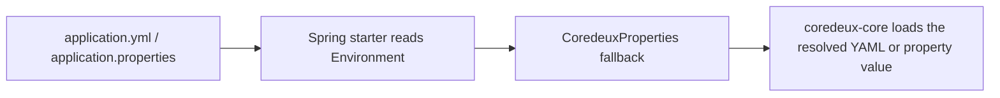

# Property Resolution Order

<!-- docs-nav-start -->
[Previous: Core Redis Reference](/modules/coredeux-core/18-core-redis-reference) | [Documentation Home](/) | [Next: Coredeux Import](/modules/coredeux-import/01-overview)
<!-- docs-nav-end -->

This page explains how Coredeux resolves configuration in practice.

The short version is:

1. Spring Boot application properties win first
2. Coredeux bundled properties come next
3. Coredeux hard defaults come last

That is the same rule for both entity-definition location and import-related
settings, and the same idea also applies to the global Coredeux fallback data
access service.

## Identifier Resolution

Coredeux also resolves entity identifiers in a fixed order:

1. `identifier` from the entity definition itself
2. `identifier` from the entity's `storage` block
3. `coredeux.identifier` from the Spring `Environment`
4. no inferred fallback

That means the framework does not guess identifiers from field names such as
`id`, `identifier`, or `uid`.

## The Two Property Sources

### Spring Boot Configuration

In a Spring Boot application, put settings in:

- `src/main/resources/application.yml`
- or `src/main/resources/application.properties`

The Spring Boot starters read from the Spring `Environment` first. That means
these values win when they are present.

### Coredeux Bundled Configuration

Coredeux core can also load:

- `src/main/resources/META-INF/coredeux.yml`

That file is loaded into `CoredeuxProperties` and acts as the bundled fallback
for native applications or for Spring apps that want a second config source.

## Resolution Order

### Entity Definition Location

For entity definitions, the Spring Boot core starter resolves:

1. `coredeux.entities.config-location` from the Spring `Environment`
2. `coredeux.entities.config-location` from `CoredeuxProperties`
3. `classpath:coredeux-entities.yml`

If the resolved location does not exist, Coredeux treats the registry as
empty and continues startup. The file is optional, but any entity-specific
behavior must still be declared if you want it to apply.

When Coredeux later resolves an entity type that is not present in the
registry, it synthesizes a default entity definition from the Java class and
the global fallback properties instead of failing with an "unknown entity"
error.

That means this Spring Boot setting works as the explicit override:

```yaml
coredeux:
  entities:
    config-location: classpath:coredeux-entities.yml
```

### Import Default Parser

For import settings, the Spring Boot import starter resolves:

1. `coredeux.import.default-parser` from the Spring `Environment`
2. `coredeux.import.default-parser` from `CoredeuxProperties`
3. `text`

That means this Spring Boot setting works as the explicit override:

```yaml
coredeux:
  import:
    default-parser: text
```

### Global Data Access Service

For the fallback data access service, Coredeux resolves:

1. `coredeux.data-access-service` from the Spring `Environment`
2. `coredeux.data-access-service` from `CoredeuxProperties`
3. no global fallback

That means this Spring Boot setting works as the default adapter bean name for
entities that do not declare their own `storage.data-access-service`:

```yaml
coredeux:
  data-access-service: postgresCoredeuxJpaDataAccessService
```

## Why This Exists

This split keeps Spring Boot apps simple:

- application owners can keep using normal Spring Boot config files
- Coredeux still has a bundled fallback for native or embedded use
- the runtime stays predictable because the override order is fixed

## Mental Model

Think of configuration in this order:



That is the only thing you need to remember when you are wiring Coredeux
properties in a Spring Boot host.

<!-- docs-nav-start -->
[Previous: Core Redis Reference](/modules/coredeux-core/18-core-redis-reference) | [Documentation Home](/) | [Next: Coredeux Import](/modules/coredeux-import/01-overview)
<!-- docs-nav-end -->
