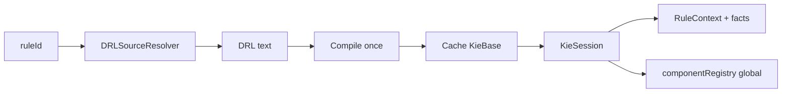

# Overview

<!-- docs-nav-start -->
[Previous: Coredeux DRL](/coredeux-drl) | [Documentation Home](/) | [Next: Native Runtime](/coredeux-drl-native-runtime)
<!-- docs-nav-end -->

`coredeux-drl` is the Coredeux runtime that executes DRL by rule id instead of
by raw source string.

## Java Support

Coredeux supports Java 17 and above.

- minimum supported runtime/build floor: Java 17
- current project/runtime baseline: Java 21
- DRL language level is chosen from the running Java version unless a config
  override is provided
- the currently verified DRL levels are `17` and `19`
- compiled rules are cached as a bundle that carries both the `KieBase` and the
  registry-global requirement
- deleting a stored rule should also purge its runtime cache entry

At a high level the runtime does four things:

- resolves DRL source from a pluggable resolver
- compiles the DRL into a cached `KieBase`
- creates a fresh `KieSession` per execution
- exposes the Coredeux component registry to rules as a global
- keeps Java-to-DRL authoring in the separate devtools module



## End-to-End Flow

The runtime path is intentionally simple:

1. your application picks a `ruleId`
2. the `DRLSourceResolver` turns that id into DRL text
3. `coredeux-drl` compiles the DRL into a `KieBase`
4. the compiled rule set is cached by `ruleId`
5. each execution creates a fresh `KieSession`
6. the runtime inserts the `RuleContext<T>` plus any extra facts
7. the rule session gets the `componentRegistry` global
8. the rules run and write results back through the context or facts

That shape matters because it keeps the runtime predictable: source lookup is
separate from compilation, compilation is separate from execution, and
execution is separate from storage.

One important authoring rule from the POC: the Java source is only an
authoring surface. After conversion, helper methods in the authoring class are
not available as reusable DRL methods. Keep each converted rule method
self-contained, and move reusable behavior into separate DRL sources or
external services that the rule resolves through the component registry.

The module is intentionally split so the core runtime stays plain Java while
the Spring Boot starter can layer on environment and application-context
integration.

The same `componentRegistry` global works in both worlds: native applications
can back it with `InMemoryCoredeuxComponentRegistry`, while Spring Boot
applications get `SpringCoredeuxComponentRegistry` through the starter.

## Hands-On Pages

If you want copyable examples, continue to the dedicated guides.
They show the Java source first, then the generated DRL, so the authoring flow
is easy to follow end to end:

- [Data Access With DRL](/coredeux-drl-data-access)
- [Validators With DRL](/coredeux-drl-validators)
- [Hooks With DRL](/coredeux-drl-hooks)
- [Audit With DRL](/coredeux-drl-audit)
- [Custom Handlers](/coredeux-drl-custom-handlers)

## What The Rules Look Like

Rules still look and feel close to normal Java inside the `then` block.

The rule source normally declares the `componentRegistry` global:

```drl
global com.coredeux.core.registry.CoredeuxComponentRegistry componentRegistry;
```

Then the consequence can resolve beans or services on demand through the
registry.

Typical rule source also binds a `RuleContext<T>`:

```drl
rule "check"
when
   $context : RuleContext(method == "check")
then
   $context.setOutput("ok");
end
```

If the rule needs additional business objects, you pass them as facts when you
call `execute(...)`.

For IDE-assisted Java authoring and source-to-DRL conversion, see
`coredeux-drl-devtools`.

## What A New Developer Should Remember

- use `ruleId` as the lookup key, not raw DRL text
- keep generated DRL in an external source you control
- invalidate the cache when the stored DRL changes
- prefer the component registry over hard-wiring container access into rules
- treat `RuleContext<T>` as the main result carrier

## Where To Go Next

If you are using plain Java, read the native runtime page.

If you are using Spring Boot, read the starter page.

<!-- docs-nav-start -->
[Previous: Coredeux DRL](/coredeux-drl) | [Documentation Home](/) | [Next: Native Runtime](/coredeux-drl-native-runtime)
<!-- docs-nav-end -->
