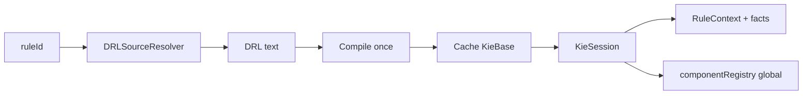

# Overview

<!-- docs-nav-start -->
[Previous: Coredeux DRL](/coredeux-drl) | [Documentation Home](/) | [Next: Native Runtime](/coredeux-drl-native-runtime)
<!-- docs-nav-end -->

`coredeux-drl` is the Coredeux runtime that executes DRL by rule id instead of
by raw source string.

At a high level the runtime does four things:

- resolves DRL source from a pluggable resolver
- compiles the DRL into a cached `KieBase`
- creates a fresh `KieSession` per execution
- exposes the Coredeux component registry to rules as a global



The module is intentionally split so the core runtime stays plain Java while
the Spring Boot starter can layer on environment and application-context
integration.

## What Makes It Useful

The runtime is meant for cases where you want:

- hot-swappable business logic
- runtime compilation without restarting the application
- rule-based dispatch by identifier
- direct access to selected Coredeux components from rule code

## What The Rules Look Like

Rules still look and feel close to normal Java inside the `then` block.

The rule source normally declares the `componentRegistry` global:

```drl
global com.coredeux.core.registry.CoredeuxComponentRegistry componentRegistry;
```

Then the consequence can resolve beans or services on demand through the
registry.

## Where To Go Next

If you are using plain Java, read the native runtime page.

If you are using Spring Boot, read the starter page.

<!-- docs-nav-start -->
[Previous: Coredeux DRL](/coredeux-drl) | [Documentation Home](/) | [Next: Native Runtime](/coredeux-drl-native-runtime)
<!-- docs-nav-end -->
